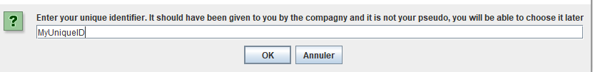
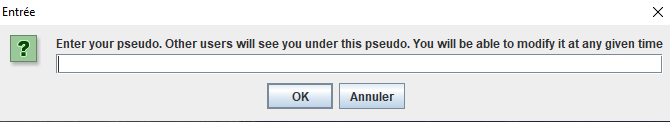
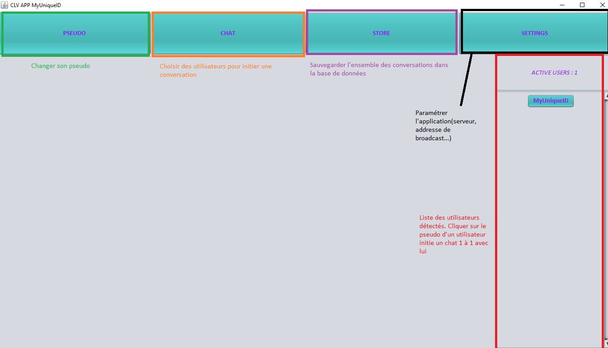
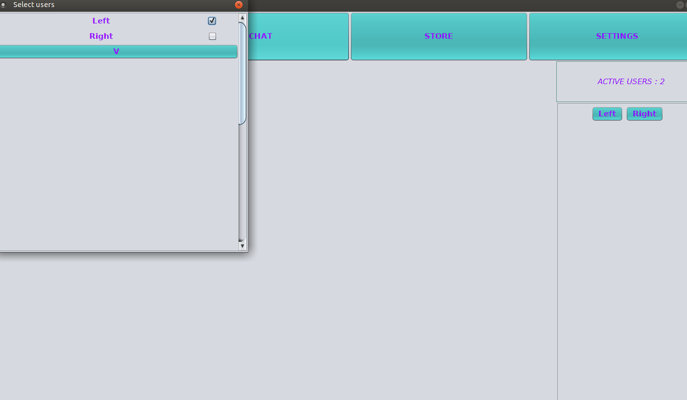
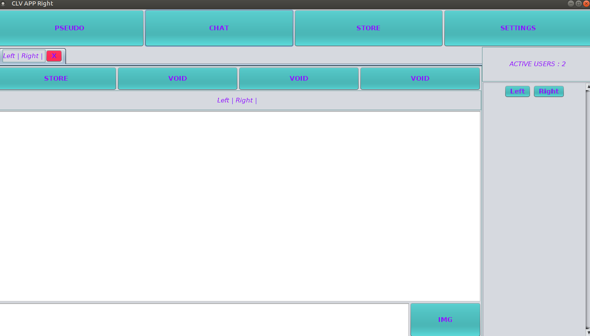
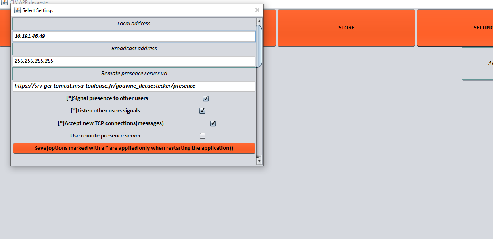
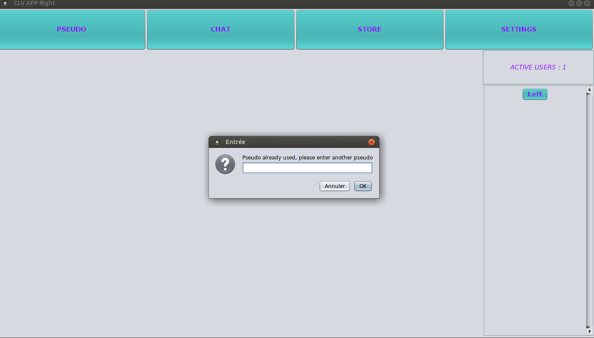

# Application de clavardage
### Denis Gouvine-Birrer et Brice Decaestecker

## Structure du projet
* `src` : fichiers sources .java
* `test` fichiers sources des classes de test du projet ,basées sur JUnit
* `web` : fichier web.xml nécessaire pour construire l'archive war de notre servlet et ladite archive war déployable
* `lib` : jar des librairies hsql, junit, et javafx utilisées
* `distribution` : une archive jar exécutable de l'application et deux dossier win et lin contenant la même archive agrémentée d'un launcher
* `capture` : captures d'écran de l'application, voire la section **Utilisation de l'application** ci -dessous

## Exécuter l'application
* Télécharger le contenu du dossier distribution/(`win` pour Windows, `lin` pour Linux, uniquement l'archive jar pour d'autres systèmes).
* Executer le fichier launcher, par exemple via un double clic leste fluide et précis, ou bien entrer la commande `java -jar CLVApp.jar`

## Déployer le serveur de présence
* Utiliser la fonction déployer du serveur tomcat en utilisant l'archive `web/gouvine_decaestecker.war`
* Le servlet est alors disponible à l'addresse [racine du serveur de déploiement]/gouvine_decaestecker/presence/
* Le serveur est actuellement déployé à l'addresse https://srv-gei-tomcat.insa-toulouse.fr/gouvine_decaestecker/presence
* La page web visualisée permet d'obtenir diverses informations sur l'état du serveur(utilisateurs connectés, dernière erreur...)

## Recompiler les sources et générer la distribution
* Nécessite [Apache Ant](https://ant.apache.org/bindownload.cgi)
* Cloner le projet 
* A la racine de ProjectPOO, entrer la commande `ant distribution`
* Le dossier `build` est généré, contenant les fichiers .class du projet
* Le dossier `doc` est généré contenant la javadoc du projet
* Le dossier `exe` est généré, contenant le jar exécutable
* Le dossier `distribution` est généré, contenant deux dossiers `win` et `lin`. Chacun de ses dossiers contient le jar exécutable et un fichier launcher.
* L'archive war `web\gouvine_decaestecker.war` est générée, correspondant au servlet déployable de notre serveur de présence
* La commande `ant clean` permet de supprimer tous ces dossiers et fichiers 

## Utilisation de l'application

* Au lancement, une fenêtre s'ouvre pour saisir son identifiant

* Puis une seconde fenêtre s'ouvre pour saisir un pseudo

* La fenêtre principale de l'application s'ouvre ensuite

* Cliquer sur un pseudo dans la liste des utilisateurs ouvre un chat avec ce dernier, il est également possible d'initier un chat avec plusieurs utilsiateurs en utilisant le bouton CHAT en haut à gauche et en cochant les pseudos souhaités( **Ne pas se cocher soit même, l'utilisateur est inclu par défaut** )

* Cliquer sur SETTINGS permet de régler certains paramètres, notamment l'addresse de broadcast et la connection avec le serveur de présence. Par exemple, on pourra utiliser l'addresse de broadcast localhost et activer le serveur de présence pour vérifier que la communication fonctionne même entre utilisateurs reliés uniquement par le serveur de présence. **Ne pas oublier de cliquer sur Save puis fermer le panneau de settings pour les appliquer.**

* Cliquer sur PSEUDO permet...de changer son pseudo, en cas de conflit soit le changement sera imédiatement rejeté(si un utilisateur avec le même pseudo est dans la liste des utilisateurs actifs) soit une fenêtre demandant un nouveau pseudo s'ouvrira.

* Cliquer sur STORE enregistre toutes les conversations courantes dans la base de données locale.

