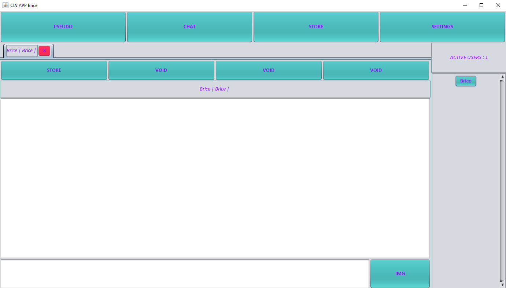

# Application de clavardage
### Denis Gouvine-Birrer et Brice Decaestecker

## Structure du projet
* `src` : fichiers sources .java
* `test` fichiers sources des classes de test du projet ,basées sur JUnit
* `web` : fichier web.xml nécessaire pour construire l'archive war de notre servlet et ladite archive war déployable
* `lib` : jar des librairies hsql, junit, et javafx utilisées
* `distribution` : une archive jar exécutable de l'application et deux dossier win et lin contenant la même archive agrémentée d'un launcher

## Exécuter l'application
* Télécharger le contenu du dossier distribution/(`win` pour Windows, `lin` pour Linux, uniquement l'archive jar pour d'autres systèmes).
* Executer le fichier launcher ou bien entrer la commande `java -jar ProtoConfig.jar`

## Déployer le serveur de présence
* Utiliser la fonction déployer du serveur tomcat en utilisant l'archive `web/gouvine_decaestecker.war`
* Le serveur est accessible à l'adresse [racine du serveur]/gouvine_decaestecker/presence
* La page web visualisée permet d'obtenir diverses informations sur le'état du serveur(utilisateurs connectés, dernière erreur...)

##Recompiler les sources et générer la distribution
* Nécessite [Apache Ant](https://ant.apache.org/bindownload.cgi)
* Cloner le projet 
* A la racine de ProjectPOO, entrer la commande `ant distribution`
* Le dossier `build` est généré, contenant les fichiers .class du projet
* Le dossier `doc` est généré contenant la javadoc du projet
* Le dossier `exe` est généré, contenant le jar exécutable
* Le dossier `distribution` est généré, contenant deux dossiers `win` et `lin`. Chacun de ses dossiers contient le jar exécutable et un fichier launcher.
* L'archive war `web\gouvine_decaestecker.war` est générée, correspondant au servlet déployable de notre serveur de présence
* La commande `ant clean` permet de supprimer tous ces dossiers et fichiers 
